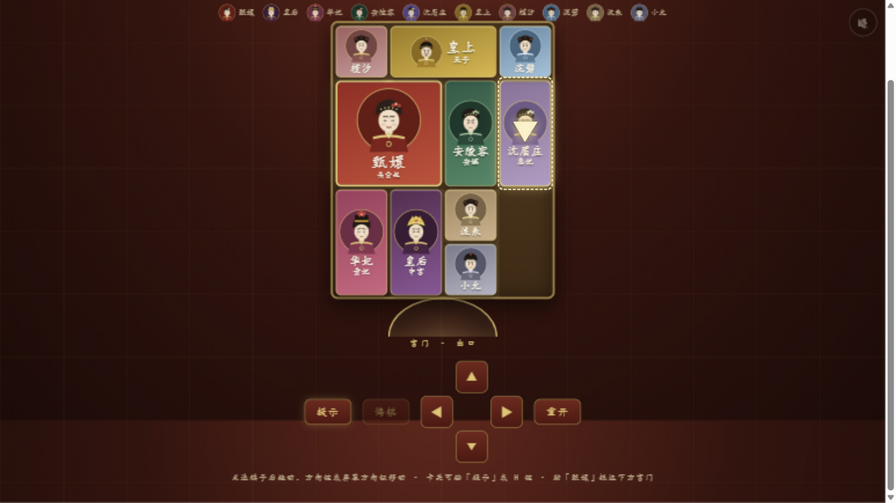

# 甄嬛传 · 深宫华容道

以《甄嬛传》为题材的经典华容道（滑动拼图）网页游戏。助「甄嬛」在 12 个剧情关卡中移出宫门，逃出深宫。

**零依赖 · 单文件 · 下载即玩**——不用安装任何东西，双击 `index.html` 即可开始。

| 主菜单 | 游戏界面（含提示系统） |
| ------ | ---------------------- |
|  |  |

## ✨ 特色

- 🎭 **甄嬛传主题**：12 个剧情关卡（倚梅园、碎玉轩、翊坤宫、甘露寺……凤临天下），每关配剧情台词
- 👘 **角色立绘**：12 位角色均有专属古风 SVG 头像——甄嬛钿子红花、皇后凤冠、华妃旗头牡丹、皇上朝冠、太医官帽、宫女双髻……眉眼表情各不相同
- 🧩 **三档难度**：简单 / 中等 / 困难，通关 3 关解锁下一档，进度自动存档
- 💡 **智能提示**：内置 BFS 求解器，卡关时一键显示最优走法的下一步与距通关步数（棋盘上以箭头标注）
- 🏆 **星级评价**：步数越接近参考最优值星级越高；胜利时甄嬛驶出宫门并有台词彩蛋
- 📱 **全端适配**：电脑鼠标拖拽 / 键盘方向键 / 手机触屏均可玩
- 🔢 **全部关卡经算法验证可解**（`node validate.js` 可复验）

## 🚀 快速开始

### 方式一：直接下载玩（推荐，无需任何环境）

1. 点击仓库页面的 **Code → Download ZIP** 下载并解压
2. 双击 `index.html`，用任意现代浏览器打开即可

### 方式二：在线玩（GitHub Pages）

1. 仓库 **Settings → Pages → Branch** 选择 `main` / `root` 保存
2. 稍等片刻，访问 `https://<你的用户名>.github.io/<仓库名>/` 即可在线游玩
3. 把链接分享给朋友，手机点开就能玩

### 方式三：本地服务器（可选，需安装 Node.js）

| 平台 | 操作 |
| ---- | ---- |
| Windows | 双击 `启动游戏.bat` |
| macOS / Linux | 运行 `./start.sh` |
| 命令行 | `node server.js`（自动打开浏览器；加 `--no-open` 则不自动打开） |

然后访问 <http://localhost:8123/>

## 🎮 玩法与操作

- **规则**：经典华容道。棋子只能沿空格一格一格滑动，不能旋转。把 2×2 的「甄嬛」移到棋盘底部中央的宫门口即可过关
- **移动**：点击选中棋子后用键盘方向键 / 屏幕方向键移动；或直接用鼠标、手指拖动棋子
- **快捷键**：`H` 提示 · `Z` 悔棋 · `R` 重开
- **提示系统**：按提示走会自动显示下一步；走错则提示作废、下次点击重新计算；悔棋会同步回退提示
- **星级**：≤ 1.3×参考步数 ★★★，≤ 1.8× ★★，通关 ★

## 📁 项目结构

```
.
├── index.html        # 游戏本体（HTML+CSS+JS 全部内嵌，单文件）
├── server.js         # 可选：本地静态服务器
├── 启动游戏.bat       # Windows 一键启动
├── start.sh          # macOS / Linux 一键启动
├── validate.js       # 开发工具：校验 12 关可解性与最优步数回归
├── screenshots/      # README 截图
└── LICENSE           # MIT 协议
```

## 🛠 技术说明

- 纯原生 HTML/CSS/JavaScript，零外部依赖、零构建步骤，兼容所有现代浏览器（含手机）
- 音效由 WebAudio 实时合成；角色立绘为参数化 SVG 生成，均无外部资源
- **BFS 最短路径求解器**：游戏内「参考步数」与「提示」都来自它。经典布局「横刀立马」实测最优 120 步（单格滑动计步口径），已与独立实现的第二求解器交叉验证一致
- 关卡数据结构清晰，想自制关卡：修改 `index.html` 中 `LEVELS_DATA`，然后运行 `node validate.js` 验证可解性与最优步数

## ❓ 常见问题

**存档存在哪里？** 浏览器 localStorage（按浏览器和域名隔离）。GitHub Pages 在线版与本地双击版存档互不相通；清浏览器缓存会丢失进度。

**双击 .bat 被 Windows 拦截？** 从网上下载的脚本文件会被标记，属正常安全提示。可右键 `启动游戏.bat` → 属性 → 勾选「解除锁定」；或干脆跳过脚本，直接双击 `index.html`（效果完全一样，不需要 Node.js）。

**手机上能玩吗？** 能。在线版直接用手机浏览器打开链接；本地版可通过局域网访问（`node server.js` 后，手机访问 `http://电脑IP:8123/`）。

**想新增关卡或调整难度？** 编辑 `LEVELS_DATA`（含每关的角色阵容与台词），运行 `node validate.js` 验证新布局：它会检查棋子构成、是否可解、并输出最优步数（难度建议：简单 ≤60 步 / 中等 60-90 / 困难 >90）。

## 📄 许可

[MIT](LICENSE) —— 欢迎自由下载、修改、分发。角色名与台词仅为游戏主题化致敬，请勿用于商业用途或过度演绎。
